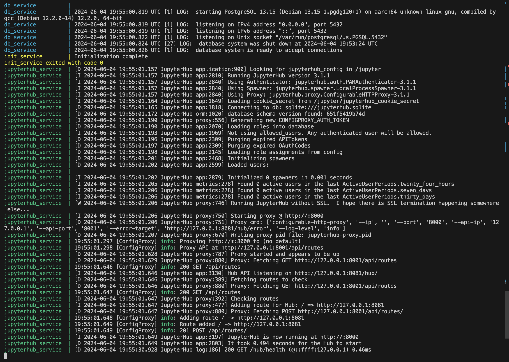

# devops-hw
Все файлы лежат в папке src

## Описание compose файла 
Файл описывает три сервиса: init, jupyterhub, и db. 
- init в данном случае - это контейнер, который выполняет команду echo "Initialization complete" при запуске. Он зависит от сервисов db и jupyterhub.
- jupyterhub - это сервис, который собирается из Dockerfile в текущем контексте сборки. Он монтирует volume ./jupyterhub_data в /srv/jupyterhub внутри контейнера и устанавливает переменные окружения для подключения к базе данных PostgreSQL.
- db - это контейнер PostgreSQL версии 13, который также устанавливает переменные окружения для настройки базы данных PostgreSQL.

Каждый сервис также имеет healthcheck.


## Скрины 


## Ответы
- Можно ли ограничивать ресурсы для сервисов в этом файле docker-compose.yml?
  - да, в compose можно указать явные ограничения. Например, по использованию памяти или ресурса CPU :
     ```
    mem_limit: 500m 
    cpu_quota: 50000
     ```
- Как можно запустить только определенный сервис из docker-compose.yml, не запуская остальные?
  - допустим, нужен только сервис init : ``` docker-compose up init ``` - запустит только init без других сервисов из compose
