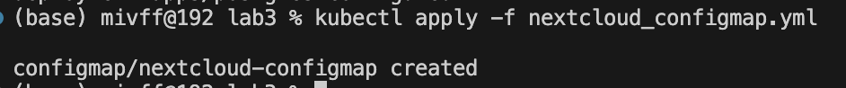
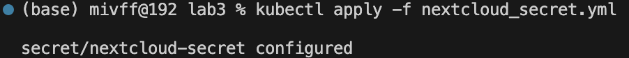
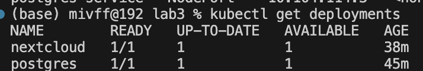

# devops-hw
## Скрины








## Вопросы
__*Важен ли порядок выполнения этих манифестов? Почему?*__

  
Да, порядок выполнения манифестов важен, поскольку некоторые ресурсы зависят от других. Вот основные причины:

- ```ConfigMap``` и ```Secret```:
Эти ресурсы должны быть созданы до Deployment, так как Deployment будет использовать их для настройки контейнеров. Если ConfigMap или Secret не существуют, когда создается Deployment, то контейнеры не смогут получить необходимые параметры для запуска и могут выйти сломаться.

- ```Service```:
Service можно создавать до или после Deployment, но лучше создавать его до, чтобы он был готов к обработке запросов, как только поды из Deployment начнут работать. Это обеспечит факт того, что все запросы смогут быть направлены к подам сразу после их создания.

- ```Deployment```:
Deployment должен быть создан после ConfigMap, Secret и Service, чтобы поды могли правильно настроиться и подключиться к необходимым ресурсам.

__*Что (и почему) произойдет, если отскейлить количество реплик postgres-deployment в 0, затем обратно в 1, после чего попробовать снова зайти на Nextcloud?*__
- Скейлим реплику в 0: все инстансы postgres упадут, кэшированные данные и все, что в памяти - потеряны
- Скейлим реплику в 1: создается новый инстанс и контейнер postgres, инициализация пода
- Таким образом сделали полный рестарт postgres, то есть, nextcloud упадет, т.к. ему нужно, чтобы postgres работал, и он будет "лежать", пока не закончится новая инициализация
- Итог : Любая новая авторизация Nextcloud в БД будет возвращать ошибку 500, все данные исчезнут, если в манифесте не монтирован volume.
