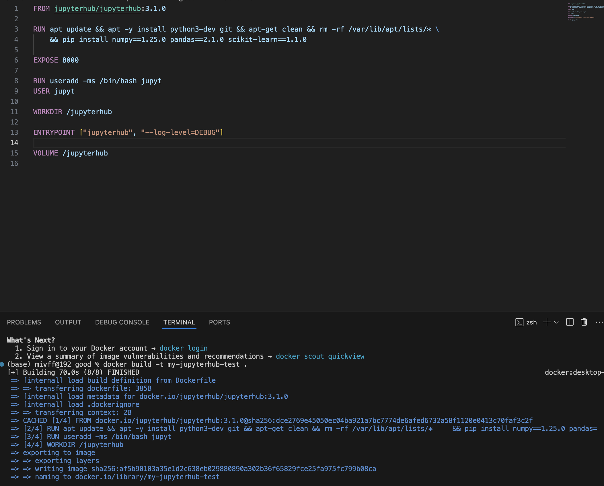
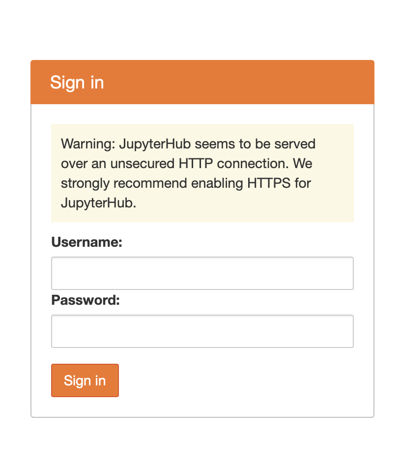

# Лаб 1
## Плохой Dockerfile

```
FROM jupyterhub/jupyterhub:latest
RUN apt update
RUN apt -y install python3-dev
RUN apt -y install git
RUN pip install numpy pandas scikit-learn

EXPOSE 8000

WORKDIR /jupyterhub

ENTRYPOINT ["jupyterhub", "--log-level=DEBUG"]

VOLUME /jupyterhub

```

## Хороший Dockerfile
```
FROM jupyterhub/jupyterhub:3.1.0

RUN apt update && apt -y install python3-dev git && apt-get clean && rm -rf /var/lib/apt/lists/* \
    && pip install numpy==1.25.0 pandas==2.1.0 scikit-learn==1.1.0

EXPOSE 8000

RUN useradd -ms /bin/bash jupyt
USER jupyt

WORKDIR /jupyterhub

ENTRYPOINT ["jupyterhub", "--log-level=DEBUG"]

VOLUME /jupyterhub
```

### Отличия
- В плохом не сохраняется версионность в явном виде : могут быть ошибки из-за несовместимости разных версий или уязвимости в коде.
- В плохом явно не указан юзер: по умолчанию root пользователь обладает всеми правами администратора, что создает риск нарушения безопасности.
- В плохом множество RUN команд, которые сильно увеличивают размер образа
- В плохом нет очистки кэша и файлов-установщиков

### Когда НЕ использовать контейнеры:
- Если масштабы разработки приложения не слишком велики: приложение выполняет достаточно простой функционал, не имеет критичных зависимостей от сторонних модулей, то в контейнерах нет необходимости.
- Если у архитектуры есть повышенные требования к безопасности данных по тем или иным причинам : тогда лучше использовать виртуальные машины.




