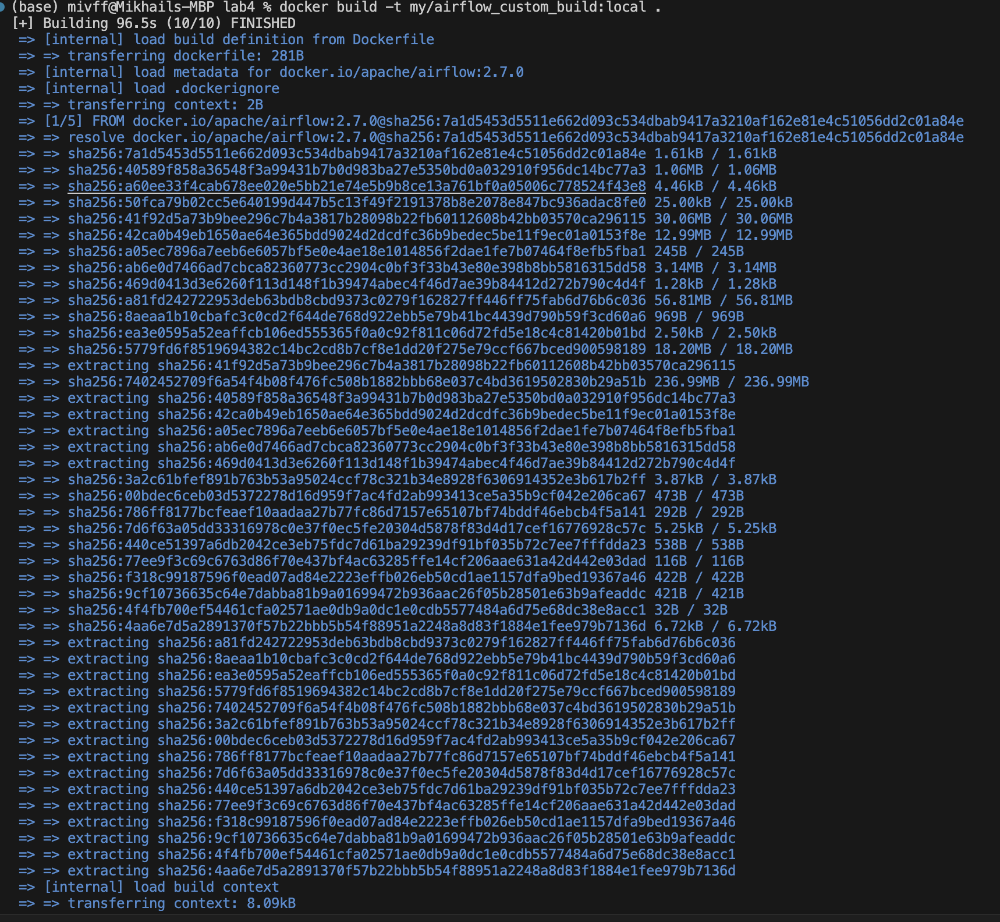
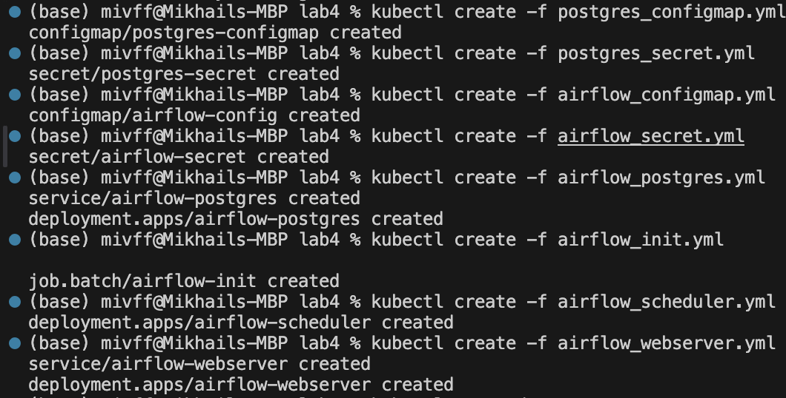
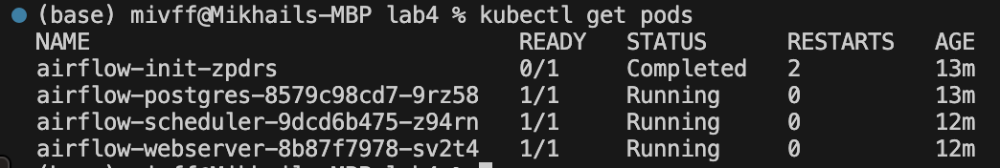
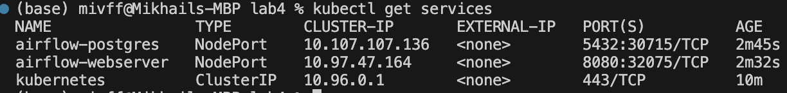
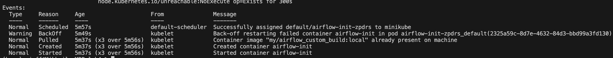

# HW-4

## Скрины







## Инструкция по использованию

### Применение конфигураций

```
- kubectl apply -f airflow-configmap.yml
- kubectl apply -f airflow-deployment.yml
- kubectl apply -f jupyter-configmap.yml
- kubectl apply -f jupyter-deployment.yml
- ...
```
