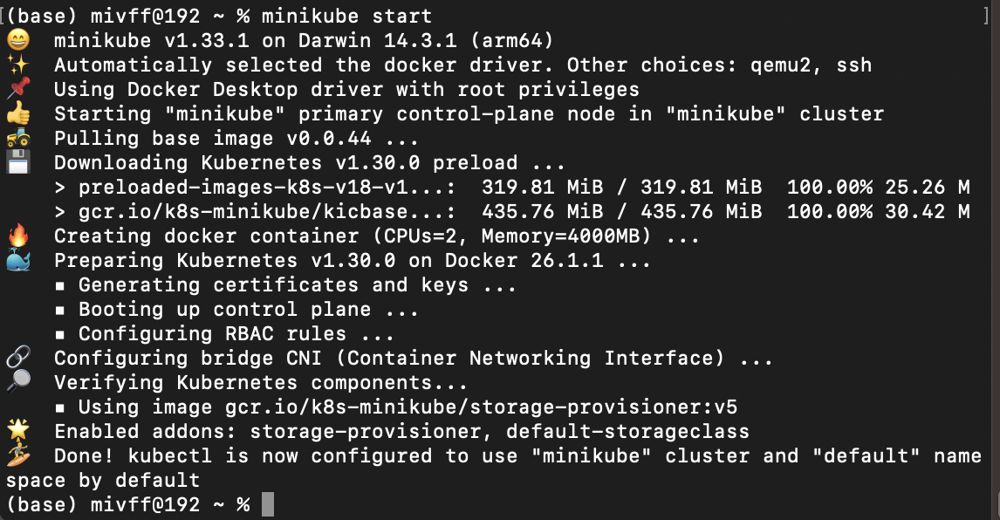
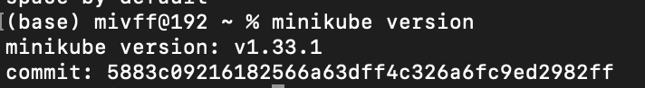
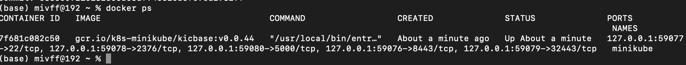
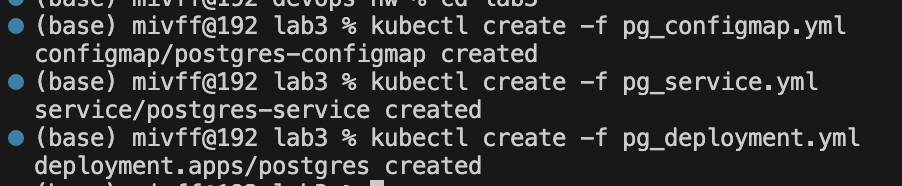
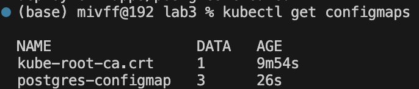
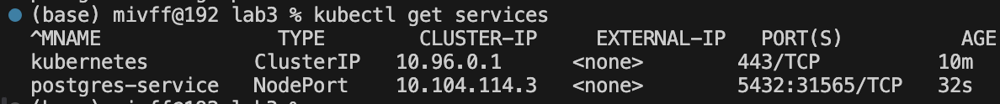
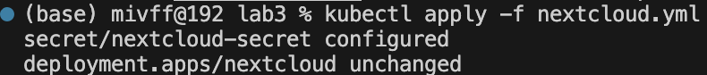
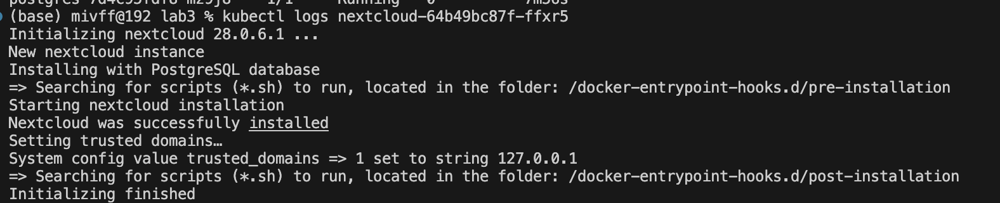
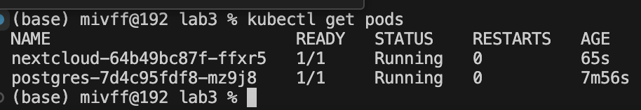
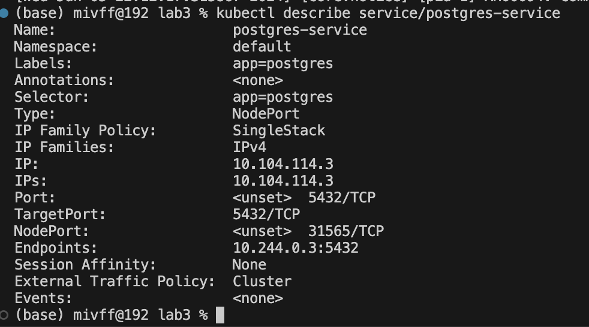

# devops-hw
## Скрины

## Вопросы
- Важен ли порядок выполнения этих манифестов? Почему?

  
Да, порядок выполнения манифестов важен, поскольку некоторые ресурсы зависят от других. Вот основные причины:

  - ConfigMap и Secret:

Эти ресурсы должны быть созданы до Deployment, так как Deployment будет использовать их для настройки контейнеров. Если ConfigMap или Secret не существуют, когда создается Deployment, то контейнеры не смогут получить необходимые параметры для запуска и могут выйти из строя.
Service:

Service можно создавать до или после Deployment, но лучше создавать его до, чтобы он был готов к обработке запросов, как только поды из Deployment начнут работать. Это обеспечит, что все запросы смогут быть направлены к подам сразу после их создания.
Deployment:

Deployment должен быть создан после ConfigMap, Secret и Service, чтобы поды могли правильно настроиться и подключиться к необходимым ресурсам.
