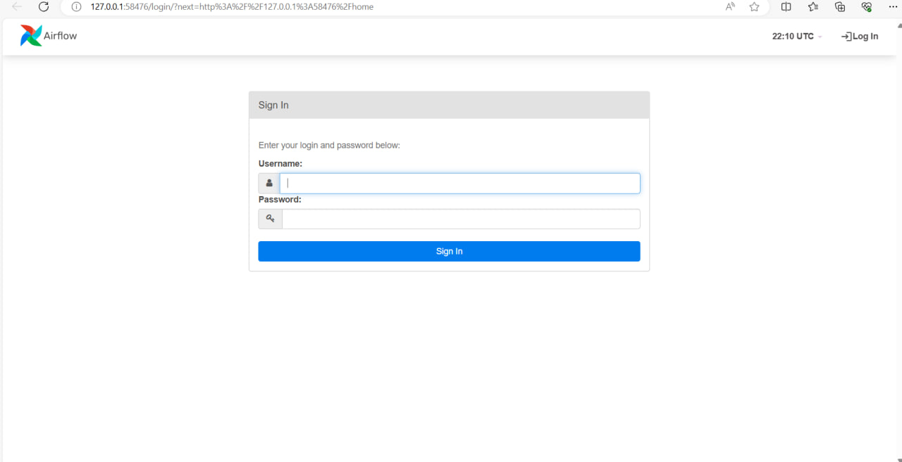

# HW-4
Все yml файлы в папке src
## Скрины



### Манифесты

```
- kubectl create -f postgres_configmap.yml
- kubectl create -f postgres_secret.yml
- kubectl create -f airflow_configmap.yml
- kubectl create -f airflow_secret.yml
- kubectl create -f airflow_postgres.yml
- kubectl create -f airflow_init.yml
- kubectl create -f airflow_scheduler.yml
- kubectl create -f airflow_webserver.yml
```
